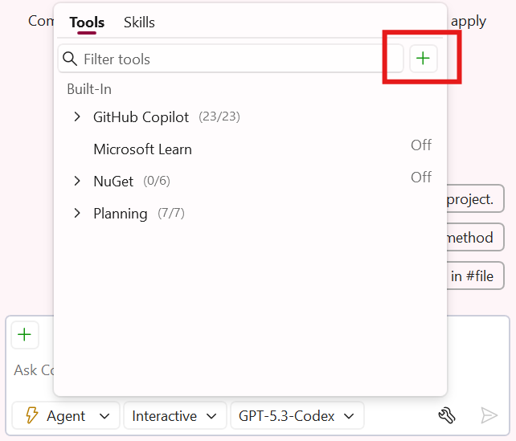
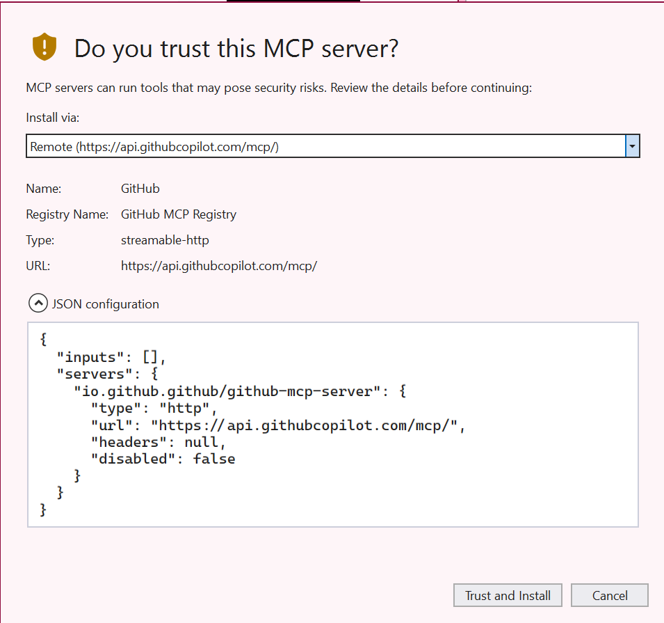
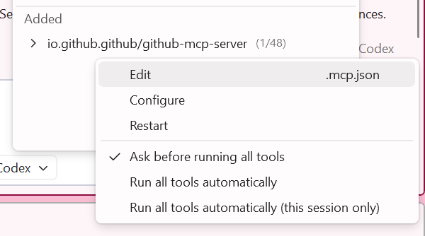
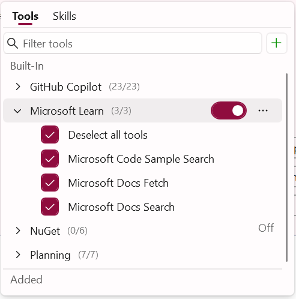
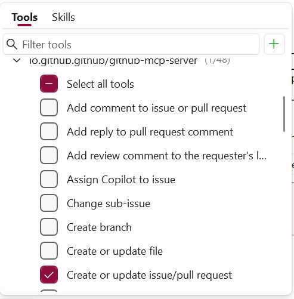

# Part 09: MCP Servers

Model Context Protocol (MCP) is an open protocol that standardizes how applications provide context to large language models (LLMs). MCP servers extend GitHub Copilot's capabilities by connecting to external tools and services, giving it access to real-time data and the ability to perform actions.

In this part, you'll learn how to add MCP servers to Visual Studio and use them to get information about optimizing your application.

## Adding MCP Servers from the Gallery

Visual Studio provides a gallery of pre-configured MCP servers that you can easily add to your project.

To see your existing tools and MCP servers installed:
1. [] Open the Copilot Chat window by clicking on the GitHub Copilot icon and selecting **Open Chat Window** or press `Ctrl+\+C`.
1. [] Click on the **Tools** icon at the bottom of the chat window to open the MCP server configuration.

   
1. Tools that are built in and from MCP servers will appear.
1. Click the **+** icon to add a new MCP server and **Add from MCP MCP**.
1. 
   
1. Specify the following
1. **Search for GitHub**
1. **Click Install** -> Trust and install Remote installation.

   

1. The GitHub MCP requires authentication. From the **Tools** menu in the chat, expand **the Added GitHub MCP** with the ... and then select **Edit**:

   

You will see a **Authentication required** message. Click on it and click Authenticate. Afer this you will see that it is online and ready to use.

   

Visual Studio 2026 has a built in MCP gallery to help you easily install MCP server.:

1. [] In Visual Studio 2026 go to **Extensions -> MCP Registries...** to open the MCP server management window.
 
   

1. [] Browse through existing MCP servers in the gallery.

> [!TIP]
> MCP servers can provide access to documentation, APIs, and other services that can help Copilot give you more accurate and contextual responses.

## Using MCP Servers to Get Information

Now that you have the Microsoft Learn and GitHub MCP servers installed, let's use them to get information about optimizing asset loading in the application.

1. [] In Copilot Chat, switch to **Agent** mode. 
1. [] Ensure that the Microsoft Learn MCP server is selected as an active tool. If you don't see it click on a new chat session or toggle modes:
  
1. [] Type the following prompt: `Using the Microsoft Learn docs mcp, what are the best practices for optimizing image loading and asset delivery in a Blazor Server application?`
1. Copilot will ask for permission for each request. You can approve each manually or **Allow in this session**
1. 
1. [] Review the response from Copilot, which now has access to the latest Microsoft documentation through the MCP server.

## Creating GitHub Issues with MCP

The GitHub MCP server allows Copilot to interact with your GitHub repository. Let's use it to create issues for improvements we want to make to the application.

1. [] Ensure that the GitHub MCP server is selected as an active tool in Copilot Chat and that the tools are enabled for .
1. [] In the same chat session, type: `Based on the asset optimization recommendations, create 3 GitHub issues for improving the TinyShop application's performance.`

   > NOTE:
   > Copilot will use the GitHub MCP server to create the issues directly in your repository. You may be prompted to authorize the action.

1. 
1. [] Review the issues that Copilot proposes to create.
1. [] Approve the creation of the issues when prompted.
1. [] Navigate to your GitHub repository to verify that the issues have been created.

**Key Takeaway**: MCP servers extend GitHub Copilot's capabilities by connecting it to external services and documentation. This allows Copilot to provide more accurate, up-to-date information and perform actions like creating GitHub issues directly from the chat interface.

---

[Back: Part 08 - Commit Summary Descriptions](./part08-commit-summary-descriptions.md) | [Next: Part 10 - Planning Mode in Agent](./part10-planning-mode.md)
