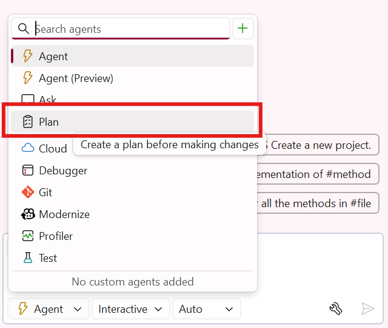
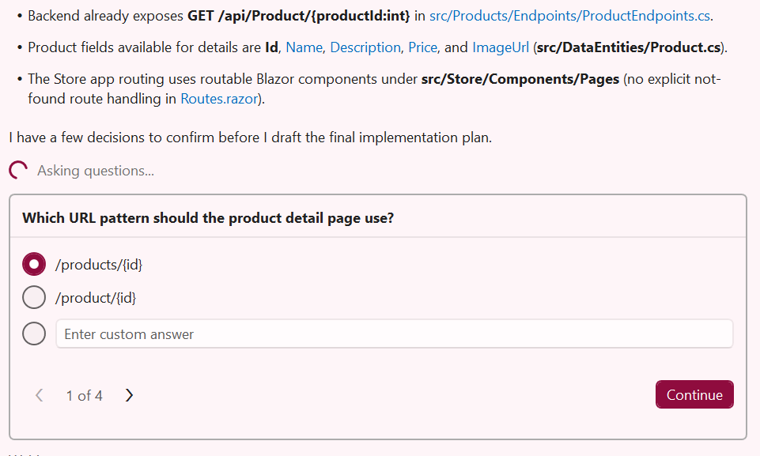
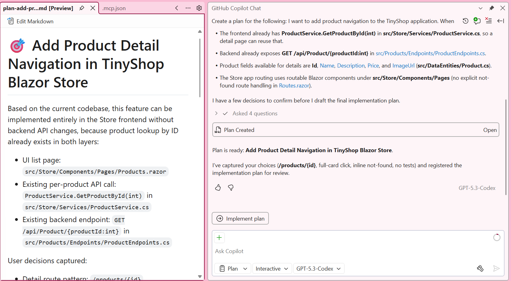
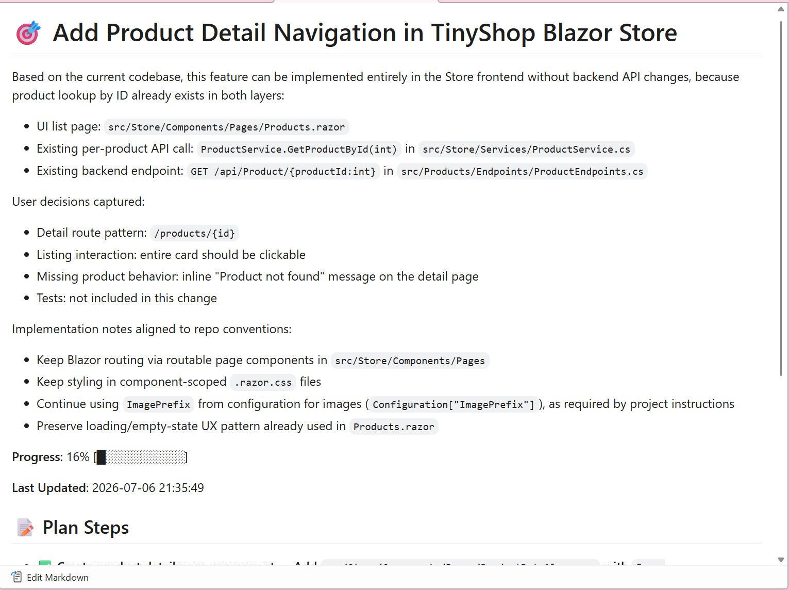

# Part 10: Planning Mode in Agent

When working on complex features, it's helpful to plan before diving into implementation. GitHub Copilot's Planning Mode in Agent allows you to create a structured plan for implementing new features. This helps ensure you understand the full scope of changes needed before any code is generated.

In this part, you'll use Planning Mode to plan and implement a feature that allows users to navigate directly to a specific product's detail page.

## Understanding Planning Mode

Planning Mode is a feature in Agent that helps you:
- Break down complex features into manageable steps
- Understand all the files and changes required before implementation
- Review and refine the plan before Copilot starts generating code

## Creating a Plan for Product Navigation

Let's use Planning Mode to implement a feature that allows users to click on a product in the listing page and navigate to a dedicated product detail page.

1. [] Open the Copilot Chat window if it's not already open.
1. [] Create a new chat session.
1. [] Switch to **Plan** mode.
1. 
1. [] Ensure **Planning** is enabled in the tools, these can also be enabled in normal **Agent* mode.

   

1. [] Enter the following prompt:

   ```
   Create a plan for the following: I want to add product navigation to the TinyShop application. When a user clicks on a product in the product listing page, they should be taken to a new product detail page that shows details. Ask me questions along the way.
   ```

   

1. Answer any questiosn along the way.

1. [] Review the plan that Copilot generates. It should include:
   - Creating a new `ProductDetail.razor` component
   - Updating routing configuration
   - Modifying the product listing to include navigation links
   - Adding any necessary CSS styling
   - Etc.

Once a plan has been created, the plan can be reviewed, iterated upon or implemented with a click of the button. 



1. [] If the plan looks good, click **Implement Plan** to begin implementation.
1. [] If you want to modify the plan, you can add additional instructions or ask Copilot to revise specific steps.

## Reviewing and Refining the Plan

Before executing, it's a good practice to review the plan carefully:

1. [] Check that all necessary files are included in the plan.
1. [] Verify the approach aligns with your project structure and coding standards.
1. [] Add any missing requirements by typing additional instructions.

For example, you might add:

```
Update the plan to also ensure the product detail page handles cases where the product ID doesn't exist by showing a "Product not found" message.
```

## Implementing the Plan

1. [] Once you're satisfied with the plan, click **Implement Plan**.
1. [] Copilot will change to **Agent** mode, implement each step of the plan, creating and modifying files as needed.
1. [] Watch teh status and eview the changes in the editor as they're made.
1. 
1. [] Run the application to test the new product navigation feature.

## Testing the Feature

1. [] Start the application with F5 or Debug -> Start Debugging.
1. [] Navigate to the Products page.
1. [] Click on a product in the listing.
1. [] Verify that you're taken to the product detail page with the correct information.
1. [] Click the "Back to Products" button to return to the listing.

**Key Takeaway**: Planning Mode helps you think through complex features before implementation. By creating a structured plan, you can ensure all necessary changes are considered and review the approach before any code is generated. This leads to better-organized code and fewer iterations.

---

[Back: Part 09 - MCP Servers](./part09-mcp.md) | [Next: Part 11 - Reusable Prompt Files](./part11-reusable-prompts.md)
