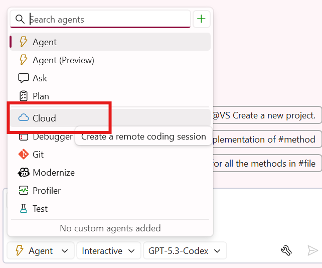
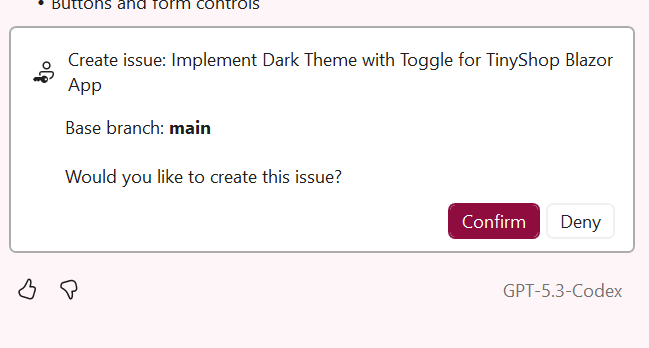
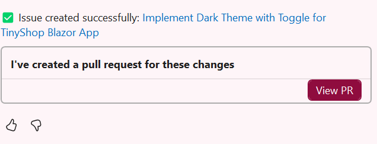
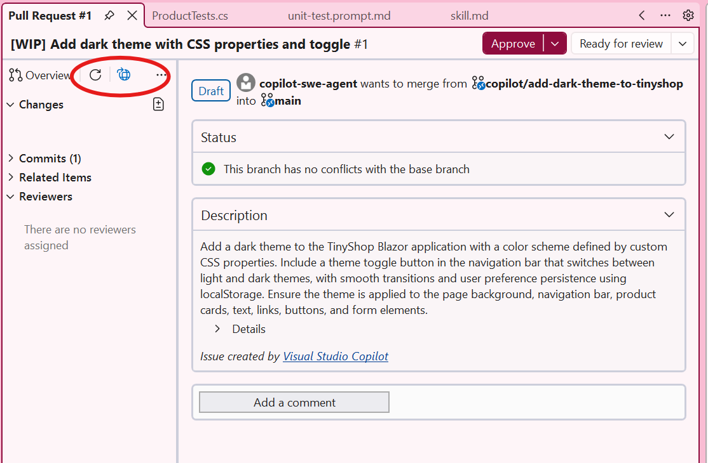

# Part 12: Delegate to the Cloud

Sometimes you have an idea for a feature or improvement that you want to implement, but you don't have the time to work on it right now. GitHub Copilot's Cloud Agent allows you to delegate tasks to run in the cloud, freeing you to focus on other work while Copilot implements the changes.

In this part, you'll learn how to delegate a task to the cloud to add a dark theme to the TinyShop application.

## Understanding Cloud Delegation

Cloud Agent allows you to:
- Submit complex tasks to run in the cloud
- Continue working on other tasks while the cloud agent implements your request
- Review and apply the changes when the task is complete
- Get notified when the work is done

This is particularly useful for:
- Large refactoring tasks
- Adding new features that require changes across multiple files
- Time-consuming implementations that don't need your immediate attention

## Preparing Your Request

Before delegating to the cloud, it's important to write a clear, detailed prompt. The cloud agent doesn't have access to your immediate context, so your prompt should include all necessary information.

1. [] Think about the feature you want to implement. For this lab, we'll add a dark theme to the TinyShop application.

1. [] Consider what details the cloud agent will need:
   - What colors should the dark theme use?
   - Should it include a toggle for users to switch themes?
   - Where should theme styles be placed?
   - Should the theme preference be persisted?

## Delegating to the Cloud

1. [] Open Copilot Chat and create a new chat
1. Switch to **Cloud** agent.

   

1. [] Enter a detailed prompt for the dark theme feature:

   ```
   Add a dark theme to the TinyShop Blazor application with the following requirements:

   1. Create a dark color scheme:
      - Background: #1a1a2e
      - Secondary background: #16213e
      - Text: #eaeaea
      - Accent: #0f3460
      - Highlight: #e94560

   2. Add a theme toggle:
      - Place a sun/moon icon button in the navigation bar
      - Clicking it should switch between light and dark themes
      - Use smooth CSS transitions for the theme switch

   3. Implementation details:
      - Use CSS custom properties (variables) for colors
      - Add theme styles in a new site-theme.css file
      - The toggle should persist the user's preference using localStorage

   4. Apply the theme to:
      - Page background
      - Navigation bar
      - Product cards
      - Text and links
      - Buttons and form elements
   ```

1. [] Review the prompt to ensure it includes all necessary details.
1. [] Click on the **Send** button (cloud icon) at the bottom of the chat window.

1. The cloud agent will acknowledge the request and begin processing it.
1. [] You will be prompted to confirm the delegation and create an issue. Click **Confirm** to proceed.

   

1. [] After the issue has been created you will be able to view the pull request for the changes in in Visual Studio or on GitHub.
  

1. When viewing on GitHub, you can see the proposed changes in the pull request, and view the session to see it in realtime.

   


## While the Task Runs

After submitting, you'll see a confirmation that your task has been delegated. You can:

1. [] Continue working on other tasks in Visual Studio.
1. [] Check the status of your cloud task in the pull request window.
1. [] Receive a notification when the task is complete.

> [!TIP]
> Cloud Agent tasks typically take several minutes to complete, depending on the complexity of the request. 


## Testing the Dark Theme

1. [] Once the cloud agent has completed the task, review the changes in the pull request and checkout the branch that the changes were made on.
1. [] Run the application with F5 or Debug -> Start Debugging.
1. [] Click the theme toggle button in the navigation bar.
1. [] Verify that the dark theme is applied correctly.
1. [] Refresh the page and verify the theme preference is persisted.
1. [] Switch back to light theme and verify it works both ways.

**Key Takeaway**: Delegating to the Cloud lets you offload complex tasks to GitHub Copilot while you focus on other work. This is especially valuable for time-consuming implementations or when you want to explore ideas without blocking your immediate workflow.

---

🎉 **Congratulations!** You've completed all 13 parts of the workshop!

[Back: Part 11 - Reusable Prompt Files](./part11-reusable-prompts.md) | [🎊 Complete Workshop!](complete.html)
